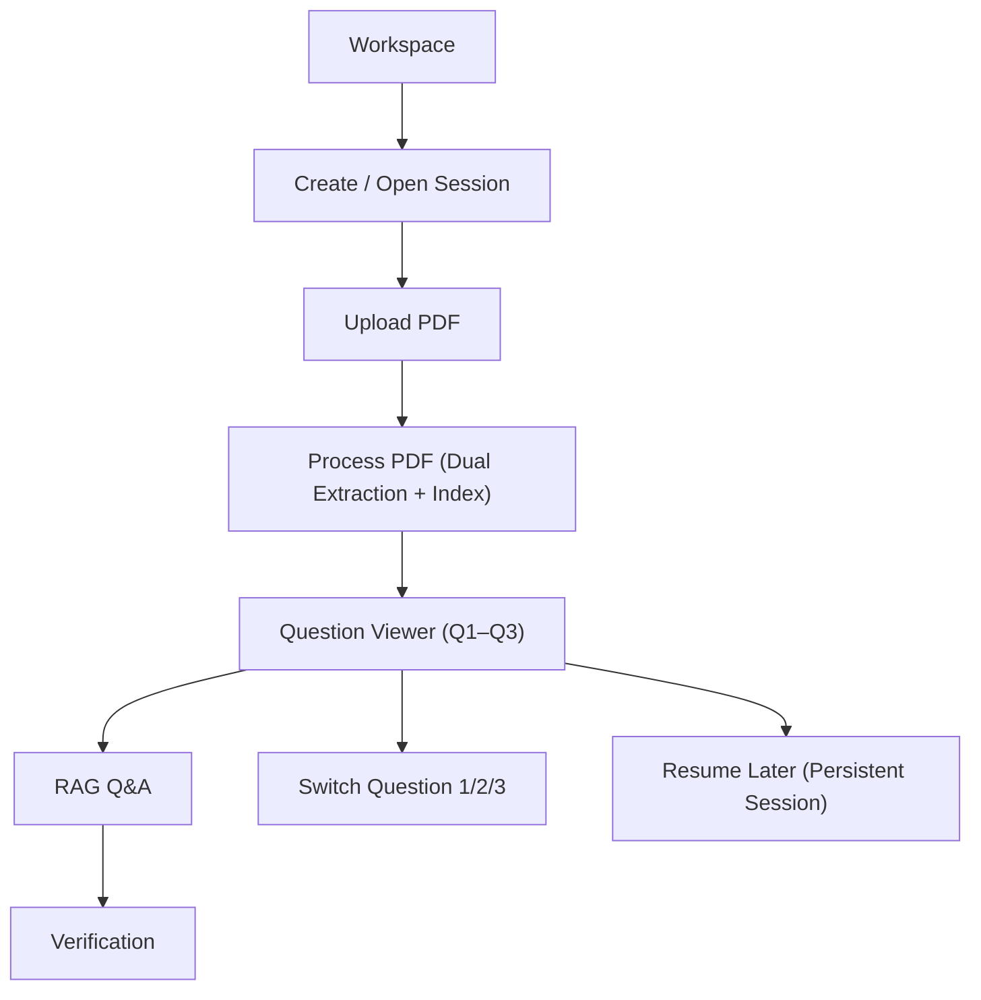

## 1. Product Overview
A web app that ingests the HKDSE Core Math 2012 exam PDF and lets you navigate Questions 1–3 with reliable math rendering.
It persists your session state, answers questions using dual extraction + RAG, and provides verification against the PDF.

## 2. Core Features

### 2.1 User Roles
| Role | Registration Method | Core Permissions |
|------|---------------------|------------------|
| User | No registration (device/session-based ID) | Upload PDF, process, navigate Q1–Q3, ask questions, view verification, resume sessions |

### 2.2 Feature Module
Our product requirements consist of the following main pages:
1. **Workspace**: create/open session, upload PDF, processing status, Q1–Q3 entry points.
2. **Question Viewer**: question navigation (1–3), PDF+extracted view, chat/Q&A, verification panel.

### 2.3 Page Details
| Page Name | Module Name | Feature description |
|-----------|-------------|---------------------|
| Workspace | Session list | Create a new session and reopen prior sessions from persistent storage. |
| Workspace | PDF upload | Upload the HKDSE Core Math 2012 PDF and show filename + basic validation/errors. |
| Workspace | Processing controls | Start/continue processing; show extraction stages (text, layout, math, chunks, index). |
| Workspace | Q1–Q3 shortcuts | Enter Question Viewer directly to Question 1/2/3. |
| Question Viewer | Question navigation | Switch among Questions 1–3; keep URL/state in sync and restore on reload. |
| Question Viewer | Dual extraction view | Display extracted question content (structured text + detected math) alongside a PDF reference view. |
| Question Viewer | Math rendering | Render extracted math reliably (inline and block) with consistent fonts and spacing. |
| Question Viewer | RAG Q&A | Ask questions grounded in the PDF; show answer with citations to relevant page/region/snippet. |
| Question Viewer | Verification | Verify an answer by highlighting supporting PDF spans and showing a pass/needs-review indicator. |
| Question Viewer | Session persistence | Save: uploaded file reference, extraction artifacts, question state, chat history, and verification results. |

## 3. Core Process
**User Flow**
1. Open Workspace and create a session.
2. Upload HKDSE Core Math 2012 PDF.
3. Run processing (dual extraction + indexing) and wait for completion.
4. Open Question Viewer for Q1–Q3.
5. Read the question with math rendering; ask questions using RAG.
6. Review citations and run verification; iterate until satisfied.
7. Leave and return later; resume the same session state.

