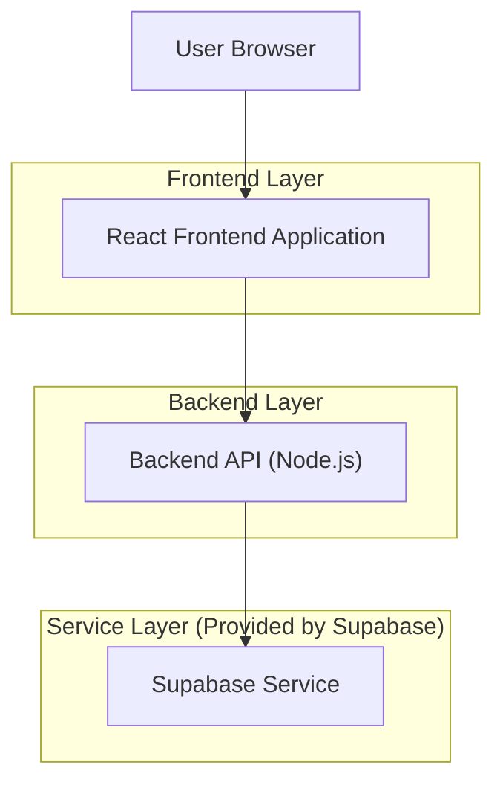
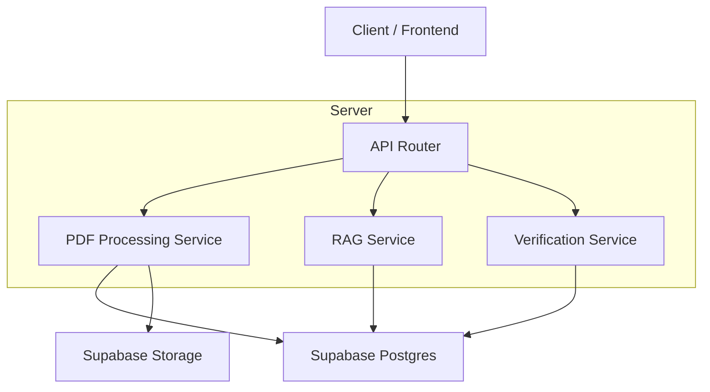
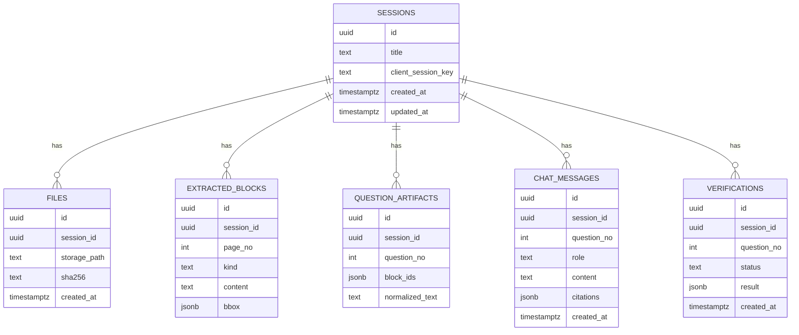

## 1.Architecture design


## 2.Technology Description
- Frontend: React@18 + TypeScript + vite + tailwindcss@3
- Backend: Node.js (Express@4) + TypeScript
- Backend (Supabase integration): @supabase/supabase-js (server-side only)
- PDF processing: pdf.js (parse/render), optional OCR module (only when text extraction fails)
- Retrieval: PostgreSQL vector search via Supabase (pgvector) + server-side embedding + ranking
- Math rendering: KaTeX (preferred) or MathJax (fallback)
- Testing: Vitest (frontend), Jest or Vitest (backend), Playwright (E2E)

## 3.Route definitions
| Route | Purpose |
|-------|---------|
| / | Workspace: sessions + upload + processing status + Q1–Q3 entry |
| /session/:sessionId/q/:questionNo | Question Viewer for Questions 1–3 with chat + verification |

## 4.API definitions (If it includes backend services)
### 4.1 Core API
Create/open a persistent session
```
POST /api/sessions
GET  /api/sessions
GET  /api/sessions/:sessionId
```

Upload and process PDF (dual extraction + indexing)
```
POST /api/sessions/:sessionId/pdf
POST /api/sessions/:sessionId/process
GET  /api/sessions/:sessionId/process/status
```

Fetch question artifacts (1–3)
```
GET /api/sessions/:sessionId/questions?range=1-3
GET /api/sessions/:sessionId/questions/:questionNo
```

RAG ask + verification
```
POST /api/sessions/:sessionId/ask
POST /api/sessions/:sessionId/verify
```

### 4.2 Shared TypeScript types
```ts
export type QuestionNo = 1 | 2 | 3;

export type Session = {
  id: string;
  title: string;
  createdAt: string;
  updatedAt: string;
};

export type ExtractedBlock = {
  id: string;
  sessionId: string;
  pageNo: number;
  kind: "text" | "math" | "figure";
  content: string; // plain text or LaTeX for math
  bbox: { x: number; y: number; w: number; h: number }; // PDF coordinate space
};

export type RagCitation = {
  pageNo: number;
  blockId?: string;
  snippet: string;
  bbox?: { x: number; y: number; w: number; h: number };
};

export type AskResponse = {
  answer: string;
  citations: RagCitation[];
};

export type VerificationResult = {
  status: "pass" | "needs_review";
  reasons: string[];
  supportingCitations: RagCitation[];
};
```

## 5.Server architecture diagram (If it includes backend services)


## 6.Data model(if applicable)
### 6.1 Data model definition


### 6.2 Data Definition Language
Sessions (sessions)
```
CREATE TABLE sessions (
  id UUID PRIMARY KEY DEFAULT gen_random_uuid(),
  title TEXT NOT NULL,
  client_session_key TEXT NOT NULL,
  created_at TIMESTAMPTZ DEFAULT NOW(),
  updated_at TIMESTAMPTZ DEFAULT NOW()
);

CREATE TABLE files (
  id UUID PRIMARY KEY DEFAULT gen_random_uuid(),
  session_id UUID NOT NULL,
  storage_path TEXT NOT NULL,
  sha256 TEXT NOT NULL,
  created_at TIMESTAMPTZ DEFAULT NOW()
);

CREATE TABLE extracted_blocks (
  id UUID PRIMARY KEY DEFAULT gen_random_uuid(),
  session_id UUID NOT NULL,
  page_no INT NOT NULL,
  kind TEXT NOT NULL,
  content TEXT NOT NULL,
  bbox JSONB NOT NULL
);

CREATE TABLE question_artifacts (
  id UUID PRIMARY KEY DEFAULT gen_random_uuid(),
  session_id UUID NOT NULL,
  question_no INT NOT NULL,
  block_ids JSONB NOT NULL,
  normalized_text TEXT NOT NULL
);

CREATE TABLE chat_messages (
  id UUID PRIMARY KEY DEFAULT gen_random_uuid(),
  session_id UUID NOT NULL,
  question_no INT NOT NULL,
  role TEXT NOT NULL,
  content TEXT NOT NULL,
  citations JSONB,
  created_at TIMESTAMPTZ DEFAULT NOW()
);

CREATE TABLE verifications (
  id UUID PRIMARY KEY DEFAULT gen_random_uuid(),
  session_id UUID NOT NULL,
  question_no INT NOT NULL,
  status TEXT NOT NULL,
  result JSONB NOT NULL,
  created_at TIMESTAMPTZ DEFAULT NOW()
);

GRANT SELECT ON sessions, files, extracted_blocks, question_artifacts, chat_messages, verifications TO anon;
GRANT ALL PRIVILEGES ON sessions, files, extracted_blocks, question_artifacts, chat_messages, verifications TO authenticated;
```

### Testing scope (required)
- Unit tests: PDF parsing utilities, question (1–3) segmentation, citation formatting, verification rule logic.
- Integration tests: end-to-end “upload → process → open Q2 → ask → verify → reload resumes session”.
- Regression tests: math rendering snapshots for representative LaTeX blocks and mixed text+math layouts.