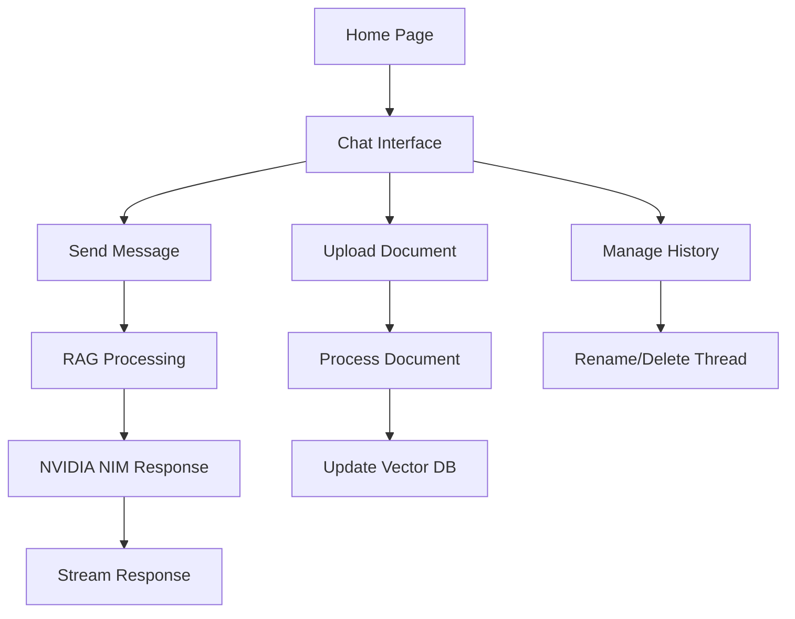

## 1. Product Overview
A modern ChatGPT-style web application that provides accurate, grounded answers to machine learning and deep learning questions using Agentic RAG (Retrieval-Augmented Generation) with NVIDIA NIM integration. The system ingests documents, maintains conversation history, and delivers low-hallucination responses with source citations.

Target users include ML/DL practitioners, researchers, students, and professionals seeking reliable, source-backed technical information.

## 2. Core Features

### 2.1 User Roles
| Role | Registration Method | Core Permissions |
|------|---------------------|------------------|
| Guest User | No registration required | Basic chat functionality, limited conversation history |
| Authenticated User | Email/password registration | Full chat history, document upload, conversation management |

### 2.2 Feature Module
The ML/DL Q&A chatbot consists of the following main pages:
1. **Chat Interface**: Main conversation area with message bubbles, streaming responses, and input field
2. **Sidebar**: Conversation history management, file upload, settings toggle
3. **Document Upload**: Drag-and-drop interface for PDF, TXT, MD files
4. **Settings**: Theme toggle, API configuration, user preferences

### 2.3 Page Details
| Page Name | Module Name | Feature description |
|-----------|-------------|---------------------|
| Chat Interface | Message Display | Show user messages and assistant responses with proper formatting and syntax highlighting |
| Chat Interface | Streaming Response | Display token-by-token streaming from NVIDIA NIM with smooth animation |
| Chat Interface | Input Area | Text input with send button, support for multiline messages |
| Chat Interface | Citations | Display source documents and chunk references for each answer |
| Sidebar | Conversation History | List all chat threads with timestamps, allow rename and delete operations |
| Sidebar | File Upload | Drag-and-drop or browse to upload documents for RAG ingestion |
| Sidebar | Theme Toggle | Switch between dark and light modes with persistent preference |
| Document Upload | File Validation | Accept PDF, TXT, MD files with size limits and format checking |
| Document Upload | Processing Status | Show ingestion progress, success/error messages |
| Settings | API Configuration | Configure NVIDIA NIM endpoint and model selection |
| Settings | User Preferences | Manage display settings, response preferences |

## 3. Core Process

### User Flow
1. User lands on chat interface with sidebar showing conversation history
2. User can start new conversation or continue existing thread
3. User types ML/DL question and sends message
4. System processes question through RAG pipeline
5. Assistant streams response with source citations
6. User can upload documents to expand knowledge base
7. User manages conversations through sidebar (rename, delete, archive)

### Document Ingestion Flow
1. User uploads document through drag-and-drop or file browser
2. System validates file format and size
3. Document is parsed, cleaned, and chunked
4. Chunks are embedded and stored in ChromaDB
5. Success confirmation shown to user

## 4. User Interface Design

### 4.1 Design Style
- **Primary Colors**: Deep blue (#1E40AF) for primary actions, slate gray (#64748B) for secondary
- **Dark Mode**: Dark slate (#0F172A) background with light text (#F8FAFC)
- **Light Mode**: White background with dark text (#1E293B)
- **Button Style**: Rounded corners (8px radius), subtle shadows, hover effects
- **Typography**: Inter font family, 16px base size, proper hierarchy
- **Icons**: Heroicons for consistency, outlined style
- **Layout**: Card-based design with proper spacing (8px grid system)

### 4.2 Page Design Overview
| Page Name | Module Name | UI Elements |
|-----------|-------------|-------------|
| Chat Interface | Message Bubbles | User messages right-aligned with blue background, assistant messages left-aligned with gray background, rounded corners, proper padding |
| Chat Interface | Input Area | Bottom-fixed input bar with rounded borders, send button with icon, supports multiline with auto-resize |
| Chat Interface | Citations | Inline citation numbers linking to source documents, expandable source preview on hover |
| Sidebar | Conversation List | Scrollable list with active state highlighting, hover effects, context menu for actions |
| Sidebar | File Upload | Dashed border drop zone with upload icon, progress bar during processing |
| Settings | Theme Toggle | Smooth animated toggle switch, immediate theme application |

### 4.3 Responsiveness
- **Desktop-first** approach with mobile optimization
- **Breakpoints**: 640px (mobile), 768px (tablet), 1024px (desktop)
- **Mobile**: Collapsible sidebar, full-width chat, optimized touch targets
- **Tablet**: Persistent sidebar with reduced width, balanced layout
- **Touch**: Larger tap targets (44px minimum), swipe gestures for navigation

### 4.4 Error States
- **Network Errors**: Clear offline indicator with retry button
- **API Errors**: User-friendly error messages with technical details collapsed
- **Upload Errors**: Specific validation messages with suggested fixes
- **Empty States**: Helpful placeholders with action prompts