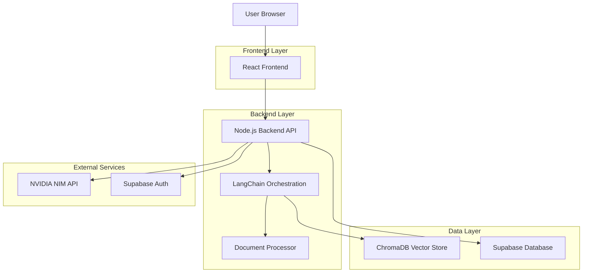
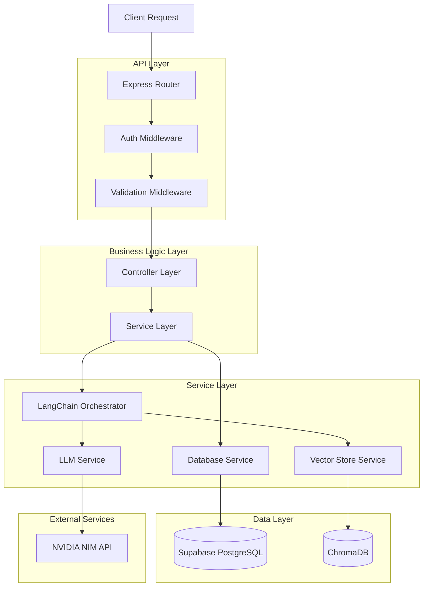
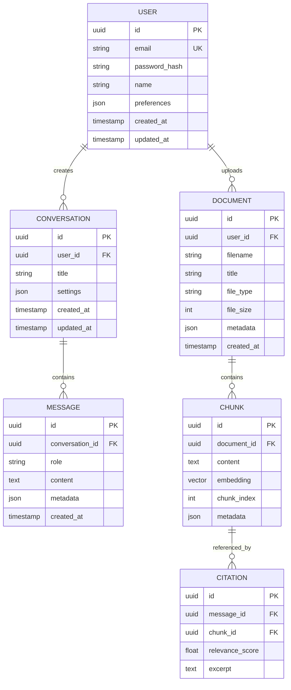

## 1. Architecture Design



## 2. Technology Description
- **Frontend**: React@18 + TypeScript@5 + Tailwind CSS@3 + Vite
- **Initialization Tool**: vite-init
- **Backend**: Node.js@20 + TypeScript@5 + Express@4
- **Orchestration**: LangChain@0.1 + LangGraph (for complex agent workflows)
- **Vector Database**: ChromaDB with local persistence
- **Authentication**: Supabase Auth
- **Database**: Supabase PostgreSQL
- **LLM Integration**: NVIDIA NIM via OpenAI-compatible client
- **File Processing**: pdf-parse, mammoth (for DOCX), markdown-it
- **Embeddings**: Configurable (OpenAI, Hugging Face, or local models)

## 3. Route Definitions
| Route | Purpose |
|-------|---------|
| / | Main chat interface with conversation history |
| /auth/login | User authentication page |
| /auth/register | User registration page |
| /auth/callback | OAuth callback handler |
| /api/chat | WebSocket endpoint for streaming chat responses |
| /api/upload | Document upload and processing endpoint |
| /api/conversations | CRUD operations for conversation history |
| /api/documents | Document management and retrieval |
| /api/health | Health check endpoint |

## 4. API Definitions

### 4.1 Chat API
```
POST /api/chat
```

Request:
| Param Name | Param Type | isRequired | Description |
|------------|-------------|-------------|-------------|
| message | string | true | User's question text |
| conversation_id | string | false | Existing conversation ID |
| model | string | false | LLM model name (default: meta/llama-3.1-8b-instruct) |
| stream | boolean | false | Enable streaming response (default: true) |

Response (Streaming):
```typescript
interface ChatResponse {
  type: 'chunk' | 'citation' | 'complete' | 'error';
  content?: string;
  citations?: Array<{
    id: string;
    source: string;
    chunk: string;
    score: number;
  }>;
  error?: string;
}
```

### 4.2 Document Upload API
```
POST /api/upload
```

Request (multipart/form-data):
| Param Name | Param Type | isRequired | Description |
|------------|-------------|-------------|-------------|
| file | File | true | Document file (PDF, TXT, MD) |
| title | string | false | Custom document title |
| tags | string[] | false | Array of tags for categorization |

Response:
```typescript
interface UploadResponse {
  success: boolean;
  document_id: string;
  chunks_processed: number;
  processing_time: number;
  error?: string;
}
```

### 4.3 Conversation Management API
```
GET /api/conversations
```

Response:
```typescript
interface Conversation {
  id: string;
  title: string;
  last_message: string;
  message_count: number;
  created_at: Date;
  updated_at: Date;
}
```

## 5. Server Architecture Diagram



## 6. Data Model

### 6.1 Data Model Definition


### 6.2 Data Definition Language

```sql
-- Users table
CREATE TABLE users (
    id UUID PRIMARY KEY DEFAULT gen_random_uuid(),
    email VARCHAR(255) UNIQUE NOT NULL,
    password_hash VARCHAR(255) NOT NULL,
    name VARCHAR(100) NOT NULL,
    preferences JSONB DEFAULT '{}',
    created_at TIMESTAMP WITH TIME ZONE DEFAULT NOW(),
    updated_at TIMESTAMP WITH TIME ZONE DEFAULT NOW()
);

-- Conversations table
CREATE TABLE conversations (
    id UUID PRIMARY KEY DEFAULT gen_random_uuid(),
    user_id UUID REFERENCES users(id) ON DELETE CASCADE,
    title VARCHAR(255) NOT NULL,
    settings JSONB DEFAULT '{}',
    created_at TIMESTAMP WITH TIME ZONE DEFAULT NOW(),
    updated_at TIMESTAMP WITH TIME ZONE DEFAULT NOW()
);

-- Messages table
CREATE TABLE messages (
    id UUID PRIMARY KEY DEFAULT gen_random_uuid(),
    conversation_id UUID REFERENCES conversations(id) ON DELETE CASCADE,
    role VARCHAR(20) NOT NULL CHECK (role IN ('user', 'assistant', 'system')),
    content TEXT NOT NULL,
    metadata JSONB DEFAULT '{}',
    created_at TIMESTAMP WITH TIME ZONE DEFAULT NOW()
);

-- Documents table
CREATE TABLE documents (
    id UUID PRIMARY KEY DEFAULT gen_random_uuid(),
    user_id UUID REFERENCES users(id) ON DELETE CASCADE,
    filename VARCHAR(255) NOT NULL,
    title VARCHAR(255) NOT NULL,
    file_type VARCHAR(50) NOT NULL,
    file_size INTEGER NOT NULL,
    metadata JSONB DEFAULT '{}',
    created_at TIMESTAMP WITH TIME ZONE DEFAULT NOW()
);

-- Create indexes for performance
CREATE INDEX idx_users_email ON users(email);
CREATE INDEX idx_conversations_user_id ON conversations(user_id);
CREATE INDEX idx_conversations_updated_at ON conversations(updated_at DESC);
CREATE INDEX idx_messages_conversation_id ON messages(conversation_id);
CREATE INDEX idx_messages_created_at ON messages(created_at);
CREATE INDEX idx_documents_user_id ON documents(user_id);

-- RLS Policies
ALTER TABLE conversations ENABLE ROW LEVEL SECURITY;
ALTER TABLE messages ENABLE ROW LEVEL SECURITY;
ALTER TABLE documents ENABLE ROW LEVEL SECURITY;

-- Conversation policies
CREATE POLICY "Users can view own conversations" ON conversations
    FOR SELECT USING (auth.uid() = user_id);

CREATE POLICY "Users can create own conversations" ON conversations
    FOR INSERT WITH CHECK (auth.uid() = user_id);

CREATE POLICY "Users can update own conversations" ON conversations
    FOR UPDATE USING (auth.uid() = user_id);

CREATE POLICY "Users can delete own conversations" ON conversations
    FOR DELETE USING (auth.uid() = user_id);
```

## 7. Environment Configuration

### 7.1 Required Environment Variables
```bash
# Frontend
VITE_API_URL=http://localhost:3001
VITE_WS_URL=ws://localhost:3001

# Backend
PORT=3001
NODE_ENV=development

# NVIDIA NIM
NVIDIA_API_KEY=your_nvidia_api_key_here
NVIDIA_BASE_URL=https://integrate.api.nvidia.com/v1
NVIDIA_MODEL=meta/llama-3.1-8b-instruct

# Supabase
SUPABASE_URL=your_supabase_url
SUPABASE_ANON_KEY=your_supabase_anon_key
SUPABASE_SERVICE_KEY=your_supabase_service_key

# ChromaDB
CHROMA_PERSIST_DIRECTORY=./data/chromadb
CHROMA_COLLECTION_NAME=ml_documents

# Embeddings
EMBEDDING_PROVIDER=openai
EMBEDDING_MODEL=text-embedding-3-small
OPENAI_API_KEY=your_openai_api_key

# File Upload
MAX_FILE_SIZE=10485760  # 10MB
UPLOAD_DIRECTORY=./uploads

# RAG Configuration
CHUNK_SIZE=1000
CHUNK_OVERLAP=200
TOP_K_RETRIEVAL=5
MMR_DIVERSITY=0.5
MIN_CONFIDENCE_SCORE=0.7
```

## 8. Deployment Considerations

### 8.1 Docker Configuration
```dockerfile
# Multi-stage build for optimization
FROM node:20-alpine AS builder
WORKDIR /app
COPY package*.json ./
RUN npm ci --only=production

FROM node:20-alpine AS runtime
WORKDIR /app
COPY --from=builder /app/node_modules ./node_modules
COPY . .
EXPOSE 3001
CMD ["npm", "start"]
```

### 8.2 Docker Compose
```yaml
version: '3.8'
services:
  app:
    build: .
    ports:
      - "3001:3001"
    environment:
      - NODE_ENV=production
    volumes:
      - ./data:/app/data
      - ./uploads:/app/uploads
    depends_on:
      - chromadb
  
  chromadb:
    image: chromadb/chroma:latest
    ports:
      - "8000:8000"
    volumes:
      - chroma_data:/chroma/chroma
    environment:
      - CHROMA_PERSIST_DIRECTORY=/chroma/chroma

volumes:
  chroma_data:
```

## 9. Migration Path to Qdrant

To migrate from ChromaDB to Qdrant:

1. **Update Dependencies**: Replace `chromadb` with `@qdrant/js-client-rest`
2. **Configuration Changes**: Update vector store configuration in services
3. **Data Migration**: Export existing embeddings and re-import to Qdrant
4. **Collection Management**: Update collection creation and indexing logic
5. **Query Interface**: Modify similarity search implementation
6. **Performance Optimization**: Leverage Qdrant's filtering and payload features

The modular architecture allows for easy swapping of vector database providers without affecting the core RAG pipeline logic.